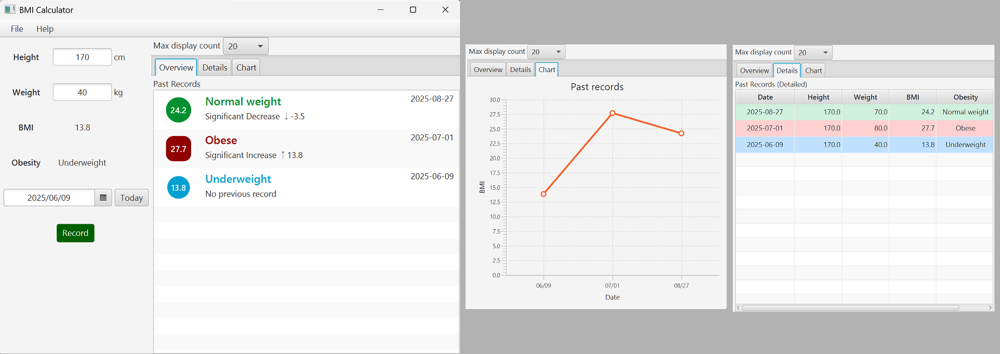
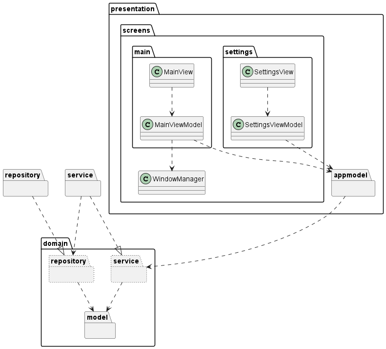

# BMI Calculator

A sample application demonstrating the [JavaFX Builder API](https://github.com/sosuisen/javafx-builder-api-generator).

This BMI (Body Mass Index) calculator showcases modern JavaFX development with MVVM architecture, fluent UI construction, and internationalization support.

## Features

- **BMI Calculation**: Calculate BMI using height and weight inputs.
- **Unit System Support**: Switch between SI (metric) and Imperial units.
- **History Management**: Store and view BMI calculation history.
- **Multiple Languages**: Support for English and Japanese.
- **Data Visualization**: View history in various formats (list, table, chart).
- **Database Storage**: SQLite database with JOOQ for data persistence.

## Screens



## Tech Stack

- **Java 23** - Latest features and performance improvements.
- **JavaFX 24.0.2** - Modern desktop UI framework with data bindings.
- **JavaFX Builder API** - Fluent API for UI construction.
  - The JavaFX Builder API is built with [JavaFX Builder API Generator](https://github.com/sosuisen/javafx-builder-api-generator).
  - Note that this artifact has not yet been registered with Maven Central.
- **MVVM Architecture** - Clean separation of concerns.
- **SQLite + JOOQ** - Lightweight database with type-safe queries.
- **Maven** - Dependency management and build automation.

## Quick Start

⚠️ Important: 

Currently, this project depends on the SNAPSHOT version of the [JavaFX Builder API](https://github.com/sosuisen/javafx-builder-api-generator).

This SNAPSHOT will soon be discontinued and replaced by an official release. Please plan to update accordingly.

### Run the Application

```bash
mvn javafx:run
```

### Build Distribution Package

```bash
mvn clean package
```
This creates:
- A native executable in `target/jpackage/` (using jpackage).

## Project Structure

```
db/ # Configurations for JOOQ

diagram/ # Overview of package dependencies

src/main/java/com/example/
├── domain/          # Domain models and interfaces
├── presentation/    # UI views, view models, components
|                    # You can find useful examples about JavaFX Builder API here.
├── repository/      # Data access implementations
├── service/         # Business logic implementations
└── main/            # Application entry point

src/main/resources/com/example/
└── i18n/            # Internationalization resources

```
## Architecture

This application follows the **MVVM (Model-View-ViewModel)** pattern,
using simple dependency injection without frameworks.



## Database

The application uses SQLite for local data storage with JOOQ for type-safe database access. The database schema is automatically generated and managed through JOOQ's code generation plugin.

## Internationalization

The application supports multiple languages through Java resource bundles:
- English (default)
- Japanese

Language files are located in `src/main/resources/com/example/i18n/`.

## Building Native Installers

The project includes jpackage configuration for creating native installers:

### Windows
```bash
mvn clean package -Pwin
```
Creates an APP_IMAGE or MSI installer (configure in profile)

### macOS
```bash
mvn clean package -Pmac
```
Creates a DMG or PKG installer

### Linux
```bash
mvn clean package -Punix
```
Creates an APP_IMAGE, RPM, or DEB package

## Development

### Running Tests
```bash
mvn test
```

### Code Generation
JOOQ code generation runs automatically during the `generate-sources` phase:
```bash
mvn generate-sources
```
